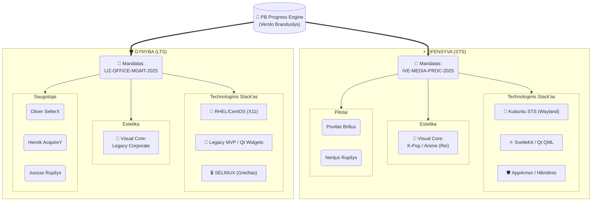

# 💎 PB Progress Engine

This repository documents the architecture and team structure for the PB Progress Engine project. The core of the engine orchestrates two major operational zones: **Offense (STS)** and **Defense (LTS)**, each with its own technical stack, team, and aesthetic direction.

## Architecture Overview

---

## 🏛️ Core

The **PB Progress Engine** ("Verslo Branduolys") forms the central foundation for two functional spheres:

- **STS (Ofensyva)** — Fast-moving, innovative, pilot-oriented operations.
- **LTS (Gynyba)** — Stable, legacy-focused, defender-oriented management.

---

## ⚡ OFENSYVA (STS ZONE)

- **Mandate:** `IVE-MEDIA-PROC-2025`
- **Tech Stack:**
  - 🐧 Kubuntu STS (Wayland)
  - ⚛️ SvelteKit / Qt QML
  - 🛡️ AppArmor / Hybrid Security
- **Visual Core:** 🌸 K-Pop / Anime (Rei)
- **Team ("Pilotai"):**
  - Povilas Brilius
  - Nerijus Rupšys

---

## 🛡️ GYNYBA (LTS ZONE)

- **Mandate:** `LIZ-OFFICE-MGMT-2025`
- **Tech Stack:**
  - 🏢 RHEL/CentOS (X11)
  - 🐘 Legacy MVP / Qt Widgets
  - 🔒 SELINUX (Strict)
- **Visual Core:** 👔 Legacy Corporate
- **Team ("Saugotojai"):**
  - Oliver SellerX
  - Henrik AcquireY
  - Juozas Rupšys

---

## Credits

Diagram & structure based on [PB.mmd](./PB.mmd).
